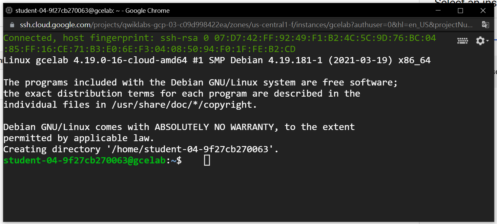

# Creating a Virtual Machine
## Overview
Compute Engine 可以讓使用者在 Google 的 infrastucture 上建立 VM，並且在上面運行不同的作業系統，像是多種版本的 Linux ( Debian, Ubuntu, Suse, Red Hat, CoreOS ) 或 Windows Server。在本章節中將使用 Google Cloud Console 和 `gcloud` 指令建立虛擬機。

下面將會用兩種不同的方式來建立自己的虛擬機：
* 使用 Cloud Console，透過 Google Cloud 平台在功能選單中依序建立 VM。
* 使用 `gcloud` 指令建立 VM。

## Task 1-1: Create a new instance from the Cloud Console 
###### 使用 Cloud Console 建立 VM
Cloud Shell 是一個在 Goolge Cloud 運行，且已經加載了開發工具的虛擬機。它提供了一個持久的 5GB 的主目錄，而我們可以在 Cloud Shell 上透過指令對 GCP 資源進行訪問。在 Task 1 中，我們要透過 Google Console 建立一個已經先定義好機器類型的虛擬機。

1. 進入 Google Cloud Platform 後由左側的**導覽 menu** 點選 &rarr; **Compute Engine** &rarr; **VM Instance** 進入管理實例的畫面。<br/>
   
   <br/>

2. 接著按下 **CREATE INSTANCE** 按鈕建立虛擬基實例。
   
   <br/>

3. 這個畫面中有許多參數可以設定，這邊我們將使用下面的規格建立 VM。
   | 屬性 | 值 | 說明 |
   | --- | --- | --- |
   | Name | gcelab | 虛擬機實例名稱 |
   | Redion | us-central1 (Iowa) | region 及 zone 之間的關係可以參考第3章，或是查看說明文件 [Regions and Zones](https://cloud.google.com/compute/docs/zones) |
   | Zone | us-central1-f | p.s. zone 的值等等會用到 |
   | Series | N1 | Series 的名稱 |
   | Machine Type | 2 vCPU|  這是一個 (n1-standard-2)、2-CPU、7.5GB RAM 實例。提供多種機器類型，從微型實例類型到 32 核/208GB RAM 實例類型。另外要注意的是，新的 project 可能會有一個默認的資源配額。更多資訊可以參考 [Machine Type](https://cloud.google.com/compute/docs/machine-types) 以及 [Resource Quota](https://cloud.google.com/compute/quotas)。 |
   | Boot Disk ( 啟動盤 ) | New 10 GB balanced persistent disk OS Image: Debian GNU/Linux 10 (buster) |  提供了多個 images，包括 Debian、Ubuntu、CoreOS 和 premium images，例如 Red Hat Enterprise Linux 和 Windows Server。 |
   | Firewall | Allow HTTP traffic | 選擇此選項以訪問稍後安裝的 Web 服務器。這個動作將自動創建防火牆以允許 port 80 上的 HTTP 請求。 |
   <br/>

   
    <br/>

4. 按下 **Create**，建立的過程可能會稍微花上幾分鐘，建立完成後就可以看到 VM 實例清單的畫面。

5. 如果要透過 SSH 跟 VM 之間建立連線，按下清單上 VM 的 SSH 屬性，這樣就可以在瀏覽器上開啟 SSH client。<br/>

   
   <br/> 

## Task 1-2: Install an NGINX web server 安裝 NGINX 網頁伺服器
接下來我們要安裝 NGINX ( engine x ) 網頁伺服器，用來連結 VM 以及其他的東西。NGINX 是一個免費的開源軟體，一個非同步框架的 web server，不過它的功用遠不僅止於 web server，它更多的用途是作為反向代理、Http Cache、負載平衡器。

1. 在上一個步驟中我們在 VM 清單上點選 SSH 後可以打開 SSG terminal ( 如下圖 )。<br/>
   

   在 SSH terminal 中輸入指令：
   ```shell
   sudo su -
   ```
   <br/>

2. 作為管理者 ( root user ) 更新 OS：
   ```shell
   apt-get update
   --------------------------------------------------------------------
   Get:1 http://security.debian.org stretch/updates InRelease [94.3 kB]
   ```
   <br/>

3. 安裝 NGINX。
   ```shell
   apt-get install nginx -y
   ----------------------------------------------------
   Reading package lists... Done
   Building dependency tree
   Reading state information... Done
   The following additional packages will be installed:
   ...
   ```
   <br/>
 
4. 確認 NGINX 是否在正在運作。
    ```shell
    ps auwx | grep nginx
    -----------------------------------------------------------------------------
    root      1933  0.0  0.0  65660  1704 ?        Ss   15:40   0:00 nginx: master process /usr/sbin/nginx -g daemon on; master_process on;
    www-data  1934  0.1  0.1  80720 11212 ?        S    15:40   0:00 nginx: worker process
    www-data  1935  0.1  0.1  80720 11216 ?        S    15:40   0:00 nginx: worker process
    root      1973  0.0  0.0   4836   820 pts/0    S+   15:40   0:00 grep nginx
    ```
    <br/>

5. 最後驗證網頁畫面是否成功被設定，方法有兩種：
   * 回到 Cloud Console 的 VM 清單中，點擊 **External IP**。 
   * 開啟新分頁，將 External IP 複製起來，在網址列輸入並替換掉 `http://EXTERNAL_IP/` 中的 `[EXTERNAL IP]`。<br/>

   

   網頁上呈現的畫面應該會長的像這樣：
   

## Task 2: Create a new instance with gcloud
1. 使用 `gcloud` 指令建立 VM 實例。
    ```shell
    gcloud compute instances create gcelab2 --machine-type n1-standard-2 --zone us-central1-f
    -----------------------------------------------------------------------------------------------
    Created [https://www.googleapis.com/compute/v1/projects/qwiklabs-gcp-03-c09d998422ea/zones/us-central1-f/instances/gcelab2].
    NAME     ZONE           MACHINE_TYPE   PREEMPTIBLE  INTERNAL_IP  EXTERNAL_IP    STATUS
    gcelab2  us-central1-f  n1-standard-2               10.128.0.3   34.122.157.77  RUNNING
    ```

    新的實例擁有以下默認屬性值：
    * 最新版本的 Debian 10 ( buster ) image。
    <br/>
    * 機器類型 ( Machine Type ) 為 `n1-standard-2`。在其他的專案你也可以選擇使用克制畫的機器類型，詳情請參考 [ custom machine type ](https://cloud.google.com/compute/docs/instances/creating-instance-with-custom-machine-type)。
    <br/>

    * 與實例相同名稱的的根永久儲存空間 ( root persistent disk )，儲存空間會自動附加到實例。
    <br/>

2. 使用這個指令可以看到所有的預設值。
   ```shell
   gcloud compute instances create --help
   ```

   > **Notes**：如果都只用一個 region 跟 zone 的話，可以透過 `gcloud` 指令進行設定，就不用每次在建立 VM 時在指令的後面加上 `--zone`。設定指令如下：
   
   * `gcloud config set compute/zone ...`
   * `gcloud config set compute/region ...`

<br/>

3. 按下 CTRL + C 可以退出 `help` 指令介面。
4. 在 Cloud Console 上面回到 VM Instances 介面，可以看到清單上的 VM 變成兩個了。( Navigation menu &rarr; Compute Engine &rarr; VM instances )
   
   <br/>

5. 同樣的我們可以透過 SSH 連結到 VM，設定方法如下：
   ```shell
   gcloud compute ssh gcelab2 --zone us-central1-f
   --------------------------------------------------------------------------
   WARNING: The public SSH key file for gcloud does not exist.
   WARNING: The private SSH key file for gcloud does not exist.
   WARNING: You do not have an SSH key for gcloud.
   WARNING: [/usr/bin/ssh-keygen] will be executed to generate a key.
   This tool needs to create the directory
   [/home/gcpstaging306_student/.ssh] before being able to generate SSH Keys.
   ```
   p.s. 這個指令是設定全域 ( global )。

6. 按下 Y 繼續。
   ```shell
   Do you want to continue? (Y/n)
   ```
   <br/>

7. 按下 ENTER 繼續。( 此處不設定密碼 )
   ```shell
   Generating public/private rsa key pair.
   Enter passphrase (empty for no passphrase)
   ```
   <br/>

8. 最後，在離開 shell 之前別忘記使用 `exit` 切斷 SSH 的連結。


## 來源
* https://google.qwiklabs.com/focuses/3563?parent=catalog

## 參考
* https://medium.com/starbugs/web-server-nginx-2-bc41c6268646
