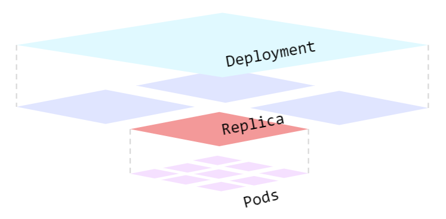

# 04 - Managing Deployments Using Kubernetes Engine
## Overview
Dev Ops practices will regularly make use of multiple deployments to manage application deployment scenarios such as "Continuous Deployment", "Blue-Green Deployments", "Canary Deployments" and more. This lab is to provide practice in scaling and managing containers so you can accomplish these common scenarios where multiple heterogeneous deployments are being used.

#### What you'll do
* Practice with kubectl tool
* Create deployment yaml files
* Launch, update, and scale deployments
* Practice with updating deployments and deployment styles
<br/>

#### Prerequisites
* Before taking this lab, you should have taken at least the labs Introduction to Docker and Hello Node Kubernetes
* Linux System Administration skills
* Dev Ops theory: concepts of continuous deployment
<br/>

## Introduction to deployments
Heterogeneous deployments typically involve connecting two or more distinct infrastructure environments or regions to address a specific technical or operational need. Heterogeneous deployments are called "hybrid", "multi-cloud", or "public-private", depending upon the specifics of the deployment. For the purposes of this lab, heterogeneous deployments include those that span regions within a single cloud environment, multiple public cloud environments (multi-cloud), or a combination of on-premises and public cloud environments (hybrid or public-private).

Various business and technical challenges can arise in deployments that are limited to a single environment or region:

* **Maxed out resources**: In any single environment, particularly in on-premises environments, you might not have the compute, networking, and storage resources to meet your production needs.<br/>

* **Limited geographic reach**: Deployments in a single environment require people who are geographically distant from one another to access one deployment. Their traffic might travel around the world to a central location.<br/>

* **Limited availability**: Web-scale traffic patterns challenge applications to remain fault-tolerant and resilient.<br/>

* **Vendor lock-in**: Vendor-level platform and infrastructure abstractions can prevent you from porting applications.<br/>

* **Inflexible resources**: Your resources might be limited to a particular set of compute, storage, or networking offerings.<br/>

Heterogeneous deployments can help address these challenges, but they must be architected using programmatic and deterministic processes and procedures. One-off or ad-hoc deployment procedures can cause deployments or processes to be brittle and intolerant of failures. Ad-hoc processes can lose data or drop traffic. Good deployment processes must be repeatable and use proven approaches for managing provisioning, configuration, and maintenance.

Three common scenarios for heterogeneous deployment are multi-cloud deployments, fronting on-premises data, and continuous integration/continuous delivery (CI/CD) processes.

The following exercises practice some common use cases for heterogeneous deployments, along with well-architected approaches using Kubernetes and other infrastructure resources to accomplish them.

## Learn about the deployment object
`explain` 指令可以顯示 Deployment object 細節，我們可以透過這個指令來了解 Deployment object 的結構與屬性代表的意思。
```shell
kubectl explain deployment
---------------------------------------------------------------------------------------
KIND:     Deployment
VERSION:  apps/v1

DESCRIPTION:
     Deployment enables declarative updates for Pods and ReplicaSets.

FIELDS:
   apiVersion   <string>
     APIVersion defines the versioned schema of this representation of an
     object. Servers should convert recognized schemas to the latest internal
     value, and may reject unrecognized values. More info:
     https://git.k8s.io/community/contributors/devel/sig-architecture/api-conventions.md#resources

   kind <string>
     Kind is a string value representing the REST resource this object
     represents. Servers may infer this from the endpoint the client submits
     requests to. Cannot be updated. In CamelCase. More info:
     https://git.k8s.io/community/contributors/devel/sig-architecture/api-conventions.md#types-kinds

   metadata     <Object>
     Standard object metadata.

   spec <Object>
     Specification of the desired behavior of the Deployment.

   status       <Object>
     Most recently observed status of the Deployment.
```

也可以使用下面這個指令來檢查所有的屬性。
```shell
kubectl explain deployment --recursive
```

而這個指令可以看到該屬性的說明。
```shell
kubectl explain deployment.metadata.name
---------------------------------------------------------------------------------
KIND:     Deployment
VERSION:  apps/v1

FIELD:    name <string>

DESCRIPTION:
     Name must be unique within a namespace. Is required when creating
     resources, although some resources may allow a client to request the
     generation of an appropriate name automatically. Name is primarily intended
     for creation idempotence and configuration definition. Cannot be updated.
     More info: http://kubernetes.io/docs/user-guide/identifiers#names
```

## Create a deployment
首先編輯 `deployments/auth.yaml` 設定檔，並用 `i` 開啟 INSERT 模式。
```shell
vi deployments/auth.yaml
```
<br/>

將 `image` 部署檔內容更改後儲存，要先按 `<Esc>` 退出 INSERT 模式，再使用 `:wq` 和 `<Enter>` 儲存並退出檔案編輯模式：
```vim
...
containers:
- name: auth
  image: "kelseyhightower/auth:1.0.0"
...
```
<br/>

再來打開 `auth.yaml` 檢查檔案內容：
```shell
cat deployments/auth.yaml
----------------------------------------------------
apiVersion: apps/v1
kind: Deployment
metadata:
  name: auth
spec:
  replicas: 1
  selector:
    matchLabels:
      app: auth
  template:
    metadata:
      labels:
        app: auth
        track: stable
    spec:
      containers:
        - name: auth
          image: "kelseyhightower/auth:1.0.0"
          ports:
            - name: http
              containerPort: 80
            - name: health
              containerPort: 81
          resources:
            limits:
              cpu: 0.2
              memory: "10Mi"
          livenessProbe:
            httpGet:
              path: /healthz
              port: 81
              scheme: HTTP
            initialDelaySeconds: 5
            periodSeconds: 15
            timeoutSeconds: 5
          readinessProbe:
            httpGet:
              path: /readiness
              port: 81
              scheme: HTTP
            initialDelaySeconds: 5
            timeoutSeconds: 1
```
在這個檔案內容中有一個 `replicas` 屬性，且值為1。這是因為我們在使用 `kubectl create` 建立部署檔時，同時也會建立一個相對應的 pod；所以也就是說，我們可以透過 `replicas` 屬性值來設定 pods 的數量。

我們可以透過下面的指令建立部署檔以及查看 deployments。
```shell
kubectl create -f deployments/auth.yaml
---------------------------------------
deployment.apps/auth created
```
```shell
kubectl get deployments
-------------------------------------------
NAME   READY   UP-TO-DATE   AVAILABLE   AGE
auth   1/1     1            1           90s
```

由於建立 deployment 的同時，Kubernets 也會幫這些 Deployment 自動建立一個 ReplicaSet，可以用這個指令來驗證，應該會看到 `auth-xxxxxxx` 類似的內容。
```shell
kubectl get replicasets
---------------------------------------------------
NAME              DESIRED   CURRENT   READY   AGE
auth-777f7b6c94   1         1         1       2m15s
```

接著我們就可以去檢視跟著這個 Deployment 一起被建立的 Pods，Pod 會在產生 Replica 的同時被 Kubernetes 建立。
```shell
kubectl get pods
--------------------------------------------------------
NAME                    READY   STATUS    RESTARTS   AGE
auth-777f7b6c94-r7rs2   1/1     Running   0          3m
```

整體而言，一個 Deployment 會有一個到多個 ReplicaSet，每當部署新的 Deployment 設定時，Kubernetes 會依據新設定重新生成一個 ReplicaSet 並保留舊設定，但同一時間下只會有一個 ReplicaSet 生效。而一個 ReplicaSet 中會掌管一個到多個 Pod，預設是一個 Pod。他們的關係大致上如下圖。<br/>


在來我們要去建立一個 Service ( 使用 `kubectl create` 指令) 以及暴露 ( expose ) hello Deployment。
```shell
# 建立 Service
kubectl create -f services/auth.yaml

# 建立 hello Deployment 相關
kubectl create -f deployments/hello.yaml
kubectl create -f services/hello.yaml
```

還有 forntend 的 Deployment。
```shell
kubectl create secret generic tls-certs --from-file tls/

kubectl create configmap nginx-frontend-conf --from-file=nginx/frontend.conf

# create
kubectl create -f deployments/frontend.yaml
kubectl create -f services/frontend.yaml
```

> Note: You created a ConfigMap for the frontend.

我們透過抓取外部 IP 以及使用 `curl` 指令來跟 frontend 互動。
```shell
kubectl get services frontend
---------------------------------------------------------------------------
NAME       TYPE           CLUSTER-IP      EXTERNAL-IP   PORT(S)         AGE
frontend   LoadBalancer   10.115.255.84   <pending>     443:31783/TCP   33s
```
```shell
curl -ks https://<EXTERNAL-IP>
------------------------------
{"message":"Hello"}
```

如果想要看到格式化後將資料以一行顯示的結果，可以使用下面的 `curl` 指令。
```shell
curl -ks https://kubectl get svc frontend -o=jsonpath="{.status.loadBalancer.ingress[0].ip}"
```
<br/>

## Scale a Deployment
到目前為止，我們建立了一個 Deployment，接下來要去調整 ( scale ) 他的規模。先讓我們來看一下 `replicas` 這個屬性的說明。
```shell
kubectl explain deployment.spec.replicas
------------------------------------------------------------------------------
KIND:     Deployment
VERSION:  apps/v1

FIELD:    replicas <integer>

DESCRIPTION:
     Number of desired pods. This is a pointer to distinguish between explicit
     zero and not specified. Defaults to 1.
```
先前有提告，一個 ReplicaSet 中會掌管一個到多個 Pod，預設會有一個 Pod，n所以如果要對這個 ReplicaSet 進行 Pods 的設定，可以對 `replicas` 這個欄位用下面的指令來進行調整：
```shell
kubectl scale deployment hello --replicas=5
-------------------------------------------
deployment.apps/hello scaled
```
這樣就可以將 ReplicaSet 下 Pod 數量的改為5。

> Note: 建立 Pod 的過程可能需要花一小段時間。

調整完之後，Kubernetes 會自動地去更新相關的 ReplicaSet，且開始建立新的 Pod 讓 Pods 的數量最終跟我們剛剛在 hello deployment 中改成的數量一樣。最後應該要有5個 Pods，可以用下面的指令查看現在有幾個 Pod 在被運行。
```shell
kubectl get pods | grep hello- | wc -l
--------------------------------------
5
```

再次去更改 hello deployment 的 `replicas` 屬性，將值變更為3後驗證一次。
```shell
kubectl scale deployment hello --replicas=3
-------------------------------------------
deployment.apps/hello scaled
```
```shell
kubectl get pods | grep hello- | wc -l
--------------------------------------
3
```
<br/>

## Rolling update 滾動升級
Kubernetes 支援 Rolling Update ( 滾動升級 )，它透過使用 Deployment 來控管 ReplicaSet 及 Pods，並確保處在服務狀態的 Pod 數量 ( replicas ) 能滿足先前所設定的值以及支援滾動升級 ( Rolling update )。另外 Depployment 也支援 Rollback ( 回滾 ) 機制。

讓 Deployment 控管多個 ReplicaSet 的主要原因在於支援Rollback ( 回滾 ) 機制。每當部署新的 Deployment 設定時，Kubernetes 會依據新設定重新生成一個 ReplicaSet 並保留舊設定，未來有需要的話就能直接利用舊的 ReplicaSet 回滾至先前狀態。( ★詳見參考 )

當 Deployment 被更新時，他會建立新的 ReplicaSet，並且慢慢的增加 replicas ( Pod ) 的數量，同時減少舊的 ReplicaSet 的 Pod 數量。<br/>


#### Trigger a rolling update
我們會用幾個步驟來更新 Deployment，首先先編輯 hello deployment 內的設定值。下面這個指令可以直接打開編輯器視窗。
```shell
kubectl edit deployment hello
-----------------------------
deployment.apps/hello edited
```

然後修改 `conatiner` 中的 `image` 的版本 ( 內容如下 )，修改完後儲存退出。
```shell
...
containers:
  image: kelseyhightower/hello:2.0.0
...
```

一旦存檔之後，新的 Deployment 會被存入 cluster 中，同時，Kubernetes 也會開始進行滾動更新。接下來，可以下這個指令去看被 Kubernetes 建立的新的 ReplicaSet。
```shell
kubectl get replicaset
-----------------------------------------------------
NAME                  DESIRED   CURRENT   READY   AGE
auth-777f7b6c94       1         1         1       15m
frontend-6869899d96   1         1         1       10m
hello-7fd855c77d      3         3         2       29s
hello-b698b846f       1         1         1       11m
```

另外，這個指令可去看 deployment 的歷史紀錄，前提是在對 deployment 異動時，指令的後面要加上 `--record` 才會被記錄在 history，例如 `kubectl edit deployment hello --record`。一般來說在對 deployment 進行異動時都會加上 `--record`，方便之後追蹤什麼時間做了那些操作。
```shell
kubectl rollout history deployment/hello
----------------------------------------
deployment.apps/hello
REVISION  CHANGE-CAUSE
1         <none>
2         <none>
```
<br/>

#### Pause a rolling update
升級過程中如果發現 Deployment 有問題，也可以暫停更新。
```shell
kubectl rollout pause deployment/hello
--------------------------------------
deployment.apps/hello paused
```

確認目前升級的狀況。
```shell
kubectl rollout status deployment/hello
------------------------------------------
> deployment "hello" successfully rolled out
```

或是直接確認 Pod 的狀況。
```shell
kubectl get pods -o jsonpath --template='{range .items[*]}{.metadata.name}{"\t"}{"\t"}{.spec.containers[0].image}{"\n"}{end}'
----------------------------------------------------------------------------------------------------------------
auth-777f7b6c94-r7rs2           kelseyhightower/auth:1.0.0
frontend-6869899d96-bd6j7               nginx:1.9.14
hello-7fd855c77d-2vkp9          kelseyhightower/hello:2.0.0
hello-7fd855c77d-58mbx          kelseyhightower/hello:2.0.0
hello-7fd855c77d-djlrc          kelseyhightower/hello:2.0.0
```

#### Resume a rolling update
當滾動升級是暫停的狀況，代表有些 pods 是舊的，而有些是新的。我們也可以透過下面的指令繼續進行滾動升級。
```shell
kubectl rollout resume deployment/hello
---------------------------------------
deployment.apps/hello resumed
```

再次確認升級的狀況。
```shell
kubectl rollout status deployment/hello
------------------------------------------
deployment "hello" successfully rolled out
```

#### Rollback an update
假設有 bug 出現在新的版本上，我們可以透過回滾機制回到上一個 deployment 的版本。
```shell
kubectl rollout undo deployment/hello
-------------------------------------
deployment.apps/hello rolled back
```

當 `rollout undo` 指令有加上 `--record` 時，一樣可以在 history 中看到紀錄。
```shell
kubectl rollout history deployment/hello
----------------------------------------
deployment.apps/hello
REVISION  CHANGE-CAUSE
2         <none>
3         <none>
```


最後只需要確認所有的 Pods 是不是都已經回到上一個版本就可以了。
```shell
kubectl get pods -o jsonpath --template='{range .items[*]}{.metadata.name}{"\t"}{"\t"}{.spec.containers[0].image}{"\n"}{end}'
```
<br/>

## Canary deployments 金絲雀部署
When you want to test a new deployment in production with a subset of your users, use a canary deployment. Canary deployments allow you to release a change to a small subset of your users to mitigate risk associated with new releases.

Create a canary deployment
A canary deployment consists of a separate deployment with your new version and a service that targets both your normal, stable deployment as well as your canary deployment.

First, create a new canary deployment for the new version:
```shell
cat deployments/hello-canary.yaml
-----------------------------------------------------------------
apiVersion: apps/v1
kind: Deployment
metadata:
  name: hello-canary
spec:
  replicas: 1
  selector:
    matchLabels:
      app: hello
  template:
    metadata:
      labels:
        app: hello
        track: canary
        # Use ver 2.0.0 so it matches version on service selector
        version: 2.0.0
    spec:
      containers:
        - name: hello
          image: kelseyhightower/hello:2.0.0
          ports:
            - name: http
              containerPort: 80
            - name: health
              containerPort: 81
...
```
Now create the canary deployment:
```shell
kubectl create -f deployments/hello-canary.yaml
-----------------------------------------------
deployment.apps/hello-canary created
```
After the canary deployment is created, you should have two deployments, hello and hello-canary. Verify it with this kubectl command:
```shell
kubectl get deployments
---------------------------------------------------
NAME           READY   UP-TO-DATE   AVAILABLE   AGE
auth           1/1     1            1           23m
frontend       1/1     1            1           18m
hello          3/3     3            3           19m
hello-canary   1/1     1            1           17s
```
On the hello service, the selector uses the app:hello selector which will match pods in both the prod deployment and canary deployment. However, because the canary deployment has a fewer number of pods, it will be visible to fewer users.

Verify the canary deployment
You can verify the hello version being served by the request:
```shell
curl -ks https://`kubectl get svc frontend -o=jsonpath="{.status.loadBalancer.ingress[0].ip}"`/version
------------------------------------------------------
{"version":"1.0.0"}
{"version":"2.0.0"}
```
Run this several times and you should see that some of the requests are served by hello 1.0.0 and a small subset (1/4 = 25%) are served by 2.0.0.

#### Canary Deployment
Canary deployments in production - session affinity
In this lab, each request sent to the Nginx service had a chance to be served by the canary deployment. But what if you wanted to ensure that a user didn't get served by the Canary deployment? A use case could be that the UI for an application changed, and you don't want to confuse the user. In a case like this, you want the user to "stick" to one deployment or the other.

You can do this by creating a service with session affinity. This way the same user will always be served from the same version. In the example below the service is the same as before, but a new sessionAffinity field has been added, and set to ClientIP. All clients with the same IP address will have their requests sent to the same version of the hello application.
```shell
kind: Service
apiVersion: v1
metadata:
  name: "hello"
spec:
  sessionAffinity: ClientIP
  selector:
    app: "hello"
  ports:
    - protocol: "TCP"
      port: 80
      targetPort: 80
```
Due to it being difficult to set up an environment to test this, you don't need to here, but you may want to use sessionAffinity for canary deployments in production.

## Blue-green deployments
Rolling updates are ideal because they allow you to deploy an application slowly with minimal overhead, minimal performance impact, and minimal downtime. There are instances where it is beneficial to modify the load balancers to point to that new version only after it has been fully deployed. In this case, blue-green deployments are the way to go.

Kubernetes achieves this by creating two separate deployments; one for the old "blue" version and one for the new "green" version. Use your existing hello deployment for the "blue" version. The deployments will be accessed via a Service which will act as the router. Once the new "green" version is up and running, you'll switch over to using that version by updating the Service.


> A major downside of blue-green deployments is that you will need to have at least 2x the resources in your cluster necessary to host your application. Make sure you have enough resources in your cluster before deploying both versions of the application at once.

#### The service
Use the existing hello service, but update it so that it has a selector app:hello, version: 1.0.0. The selector will match the existing "blue" deployment. But it will not match the "green" deployment because it will use a different version.

First update the service:
```shell
kubectl apply -f services/hello-blue.yaml
-----------------------------------------
service/hello configured
```
NOTE: Ignore the warning that says resource service/hello is missing as this is patched automatically.

#### Updating using Blue-Green Deployment
In order to support a blue-green deployment style, we will create a new "green" deployment for our new version. The green deployment updates the version label and the image path.
```shell
apiVersion: apps/v1
kind: Deployment
metadata:
  name: hello-green
spec:
  replicas: 3
  selector:
    matchLabels:
      app: hello
  template:
    metadata:
      labels:
        app: hello
        track: stable
        version: 2.0.0
    spec:
      containers:
        - name: hello
          image: kelseyhightower/hello:2.0.0
          ports:
            - name: http
              containerPort: 80
            - name: health
              containerPort: 81
          resources:
            limits:
              cpu: 0.2
              memory: 10Mi
          livenessProbe:
            httpGet:
              path: /healthz
              port: 81
              scheme: HTTP
            initialDelaySeconds: 5
            periodSeconds: 15
            timeoutSeconds: 5
          readinessProbe:
            httpGet:
              path: /readiness
              port: 81
              scheme: HTTP
            initialDelaySeconds: 5
            timeoutSeconds: 1
```

Create the green deployment:

```shell
kubectl create -f deployments/hello-green.yaml
----------------------------------------------
deployment.apps/hello-green created
```
Once you have a green deployment and it has started up properly, verify that the current version of 1.0.0 is still being used:
```shell
curl -ks https://`kubectl get svc frontend -o=jsonpath="{.status.loadBalancer.ingress[0].ip}"`/version
-------------------------------------------------
{"version":"1.0.0"}
```
Now, update the service to point to the new version:
```shell
kubectl apply -f services/hello-green.yaml
------------------------------------------
service/hello configured
```
With the service is updated, the "green" deployment will be used immediately. You can now verify that the new version is always being used.
```shell
curl -ks https://`kubectl get svc frontend -o=jsonpath="{.status.loadBalancer.ingress[0].ip}"`/version
----------------------------------------------------
{"version":"2.0.0"}
```

#### Blue-Green Rollback
If necessary, you can roll back to the old version in the same way. While the "blue" deployment is still running, just update the service back to the old version.
```shell
kubectl apply -f services/hello-blue.yaml
-----------------------------------------
service/hello configured
```
Once you have updated the service, your rollback will have been successful. Again, verify that the right version is now being used:
```shell
curl -ks https://`kubectl get svc frontend -o=jsonpath="{.status.loadBalancer.ingress[0].ip}"`/version
--------------------------------------------
{"version":"2.0.0"}
```
You did it! You learned about blue-green deployments and how to deploy updates to applications that need to switch versions all at once.

## 來源
* https://google.qwiklabs.com/focuses/639?parent=catalog

## 參考
* https://tachingchen.com/tw/blog/kubernetes-rolling-update-with-deployment/